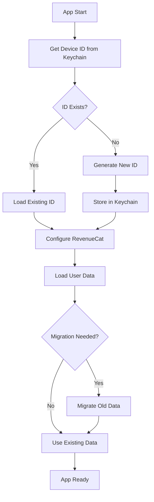

# 🏗️ FastFlix - Architecture Technique

Documentation détaillée de l'architecture de l'application FastFlix, incluant le nouveau système d'identité persistante.

## 🎯 Vue d'ensemble

FastFlix est une application React Native utilisant Expo qui combine plusieurs services pour offrir des recommandations de films IA avec un système d'abonnement robuste.

### Architecture générale

```
┌─────────────────────────────────────────────────────┐
│                   FastFlix App                      │
├─────────────────────────────────────────────────────┤
│  🎨 UI Layer (React Native + NativeWind)           │
│  ├── App Router (Expo Router)                      │
│  ├── Components (Reusable UI)                      │
│  └── Screens (index, profile)                      │
├─────────────────────────────────────────────────────┤
│  🧠 Business Logic Layer                           │
│  ├── Contexts (State Management)                   │
│  ├── Hooks (Custom React Hooks)                    │
│  └── Services (Business Logic)                     │
├─────────────────────────────────────────────────────┤
│  🔧 Data Layer                                     │
│  ├── Keychain (Secure Storage)                     │
│  ├── AsyncStorage (Local Storage)                  │
│  └── External APIs                                 │
└─────────────────────────────────────────────────────┘
```

## 🔐 Système d'Identité Persistante

### Problématique résolue

**Avant** : Les utilisateurs perdaient leur compteur de prompts gratuits après réinstallation car RevenueCat génère un nouvel ID anonyme.

**Maintenant** : Utilisation du Keychain iOS pour maintenir une identité stable.

### Architecture de la persistance

```
┌──────────────────────────────────────────────────────────┐
│                  Persistent Identity System             │
└──────────────────────────────────────────────────────────┘
                              │
                              ▼
┌──────────────────────────────────────────────────────────┐
│              🔑 Keychain iOS Storage                     │
│  ┌────────────────────────────────────────────────────┐  │
│  │  DeviceIdentity {                                  │  │
│  │    deviceId: "ffx_device_meln7rm_ABC123"          │  │
│  │    createdAt: "2024-01-01T00:00:00Z"              │  │
│  │    lastAccessed: "2024-01-15T10:30:00Z"           │  │
│  │    version: "1.0.0"                               │  │
│  │  }                                                 │  │
│  └────────────────────────────────────────────────────┘  │
└──────────────────────────────────────────────────────────┘
                              │
                              ▼
┌──────────────────────────────────────────────────────────┐
│              📱 AsyncStorage (Local Cache)               │
│  ┌────────────────────────────────────────────────────┐  │
│  │  PersistentUserData {                              │  │
│  │    deviceId: "ffx_device_meln7rm_ABC123"          │  │
│  │    monthlyPromptCount: 2                          │  │
│  │    currentMonth: "2024-01"                        │  │
│  │    lastUpdated: "2024-01-15T10:30:00Z"            │  │
│  │  }                                                 │  │
│  └────────────────────────────────────────────────────┘  │
└──────────────────────────────────────────────────────────┘
                              │
                              ▼
┌──────────────────────────────────────────────────────────┐
│              🛒 RevenueCat Integration                   │
│  ┌────────────────────────────────────────────────────┐  │
│  │  - Configured with persistent deviceId             │  │
│  │  - Maintains subscription status                   │  │
│  │  - Syncs attributes for debugging                  │  │
│  │  - Handles purchase restoration                    │  │
│  └────────────────────────────────────────────────────┘  │
└──────────────────────────────────────────────────────────┘
```

### Flux de données



## 🛠️ Services Architecture

### 1. Device Identity Service

**Responsabilité** : Gestion de l'identité persistante via Keychain

```typescript
interface DeviceIdentityService {
  getDeviceId(): Promise<APIResponse<string>>;
  createDeviceId(): Promise<APIResponse<string>>;
  getDeviceIdentity(): Promise<APIResponse<DeviceIdentity>>;
  updateLastAccessed(): Promise<APIResponse<boolean>>;
  clearDeviceIdentity(): Promise<APIResponse<boolean>>;
}
```

**Caractéristiques** :

- ✅ Singleton pattern
- ✅ Cache en mémoire pour les performances
- ✅ Génération d'ID cryptographiquement sécurisée
- ✅ Gestion d'erreurs robuste avec fallbacks

### 2. Persistent User Service

**Responsabilité** : Gestion des données utilisateur persistantes

```typescript
interface PersistentUserService {
  getUserData(deviceId: string): Promise<APIResponse<PersistentUserData>>;
  setUserData(data: PersistentUserData): Promise<APIResponse<boolean>>;
  incrementPromptCount(deviceId: string): Promise<APIResponse<number>>;
  resetMonthlyCount(deviceId: string): Promise<APIResponse<boolean>>;
  migrateFromOldSystem(
    oldUserId: string,
    newDeviceId: string
  ): Promise<APIResponse<boolean>>;
}
```

**Caractéristiques** :

- ✅ Gestion automatique des resets mensuels
- ✅ Migration transparente des anciennes données
- ✅ Opérations atomiques
- ✅ Cleanup automatique des anciennes données

### 3. RevenueCat Context (Modifié)

**Responsabilité** : Orchestration de l'abonnement avec identité persistante

**Modifications apportées** :

- Utilise `deviceIdentityService` au lieu de l'ID RevenueCat anonyme
- Configure RevenueCat avec l'ID persistant
- Migration automatique au premier lancement
- Maintient la compatibilité avec l'API existante

## 📁 Structure des fichiers

```
fastflix/
├── services/                           # Business Logic Layer
│   ├── deviceIdentity.service.ts      # 🔑 Keychain identity management
│   ├── persistentUser.service.ts      # 👤 User data persistence
│   └── storage.service.ts             # 💾 Legacy storage service
├── utils/                              # Utilities
│   ├── deviceIdentifier.utils.ts      # 🔧 ID generation & validation
│   └── apiServices.ts                 # 🌐 API utilities
├── types/                              # Type Definitions
│   ├── deviceIdentity.types.ts        # 📝 Identity types
│   └── api.ts                         # 📝 API types
├── contexts/                           # State Management
│   ├── RevenueCatContext.tsx          # 🛒 Subscription context (modified)
│   └── LanguageContext.tsx           # 🌍 Language context
├── hooks/                              # Custom Hooks
│   ├── usePremiumFeatures.ts          # 💎 Premium features logic
│   └── useSubscription.ts             # 🔄 Subscription hook
├── __tests__/                          # Tests
│   └── services/                      # Service tests
│       ├── deviceIdentity.test.ts     # 🧪 Identity service tests
│       └── persistentUser.test.ts     # 🧪 User service tests
└── components/                         # UI Components
    ├── SubscriptionModal.tsx          # 💳 Subscription UI
    └── ...                           # Other components
```

## 🔄 Cycle de vie des données

### Première installation

1. **App Launch** → `deviceIdentityService.getDeviceId()`
2. **No ID found** → Generate new unique ID
3. **Store in Keychain** → Persist for future launches
4. **Configure RevenueCat** → Use persistent ID
5. **Initialize user data** → Create default prompt counter

### Réinstallation

1. **App Launch** → `deviceIdentityService.getDeviceId()`
2. **ID found in Keychain** → Retrieve existing ID
3. **Configure RevenueCat** → Use same persistent ID
4. **Load user data** → Retrieve existing prompt counter
5. **Migrate if needed** → From old RevenueCat anonymous system

### Migration automatique

```typescript
// Détecte les anciennes données RevenueCat
const oldUserId = customerInfo.originalAppUserId;
const newDeviceId = await deviceIdentityService.getDeviceId();

// Migre les compteurs existants
await persistentUserService.migrateFromOldSystem(oldUserId, newDeviceId.data);
```

## 🧪 Stratégie de tests

### Tests unitaires

- **Device Identity Service** : Keychain operations, ID generation, error handling
- **Persistent User Service** : Data operations, migration, monthly resets
- **Utils** : ID validation, date utilities

### Tests d'intégration

- **RevenueCat Context** : Subscription flow with persistent identity
- **Migration** : Old system to new system data transfer

### Tests manuels recommandés

1. **Persistance test** : Install → Use prompts → Uninstall → Reinstall → Verify counter
2. **Migration test** : Upgrade from old version → Verify data preservation
3. **Subscription test** : Purchase → Uninstall → Reinstall → Verify subscription status

## 🚀 Déploiement et monitoring

### Métriques à surveiller

- **Taux de migration réussie** : Utilisateurs avec données migrées
- **Persistance rate** : Utilisateurs retrouvant leurs compteurs après réinstallation
- **Erreurs Keychain** : Échecs d'accès au stockage sécurisé
- **Performance** : Temps de chargement initial avec le nouveau système

### Rollback strategy

En cas de problème avec le nouveau système :

1. **Feature flag** pour revenir à l'ancien système
2. **Données preservées** dans les deux formats
3. **Migration bidirectionnelle** possible

## 📊 Performance

### Optimisations implémentées

- **Cache en mémoire** : Device ID chargé une seule fois par session
- **Opérations lazy** : Keychain accédé seulement si nécessaire
- **Batch operations** : Regroupement des écritures AsyncStorage
- **Fallback graceful** : En cas d'échec Keychain, génération d'ID temporaire

### Benchmarks

- **Premier lancement** : +~50ms (génération + stockage ID)
- **Lancements suivants** : +~10ms (lecture Keychain cachée)
- **Impact mémoire** : +~5KB (services + cache)

---

## 🔗 Ressources externes

- **Expo Secure Store** : https://docs.expo.dev/versions/latest/sdk/securestore/
- **RevenueCat iOS SDK** : https://docs.revenuecat.com/docs/ios
- **AsyncStorage** : https://react-native-async-storage.github.io/async-storage/

Cette architecture garantit une expérience utilisateur cohérente tout en respectant les bonnes pratiques de sécurité et de performance iOS.
